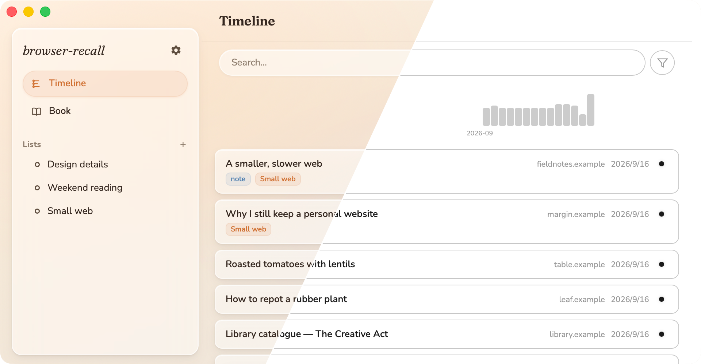
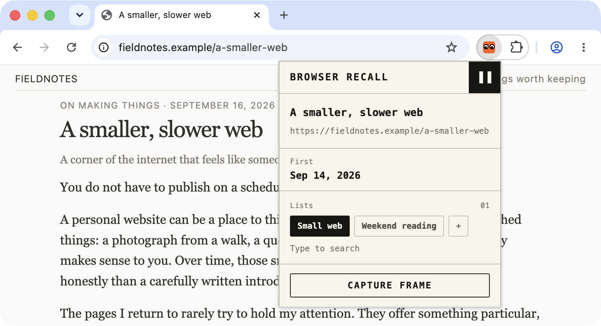
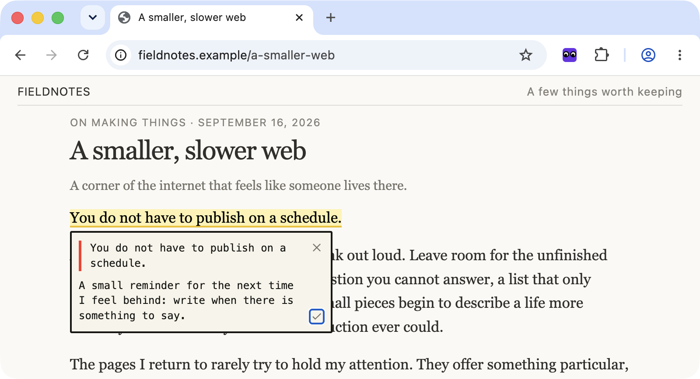
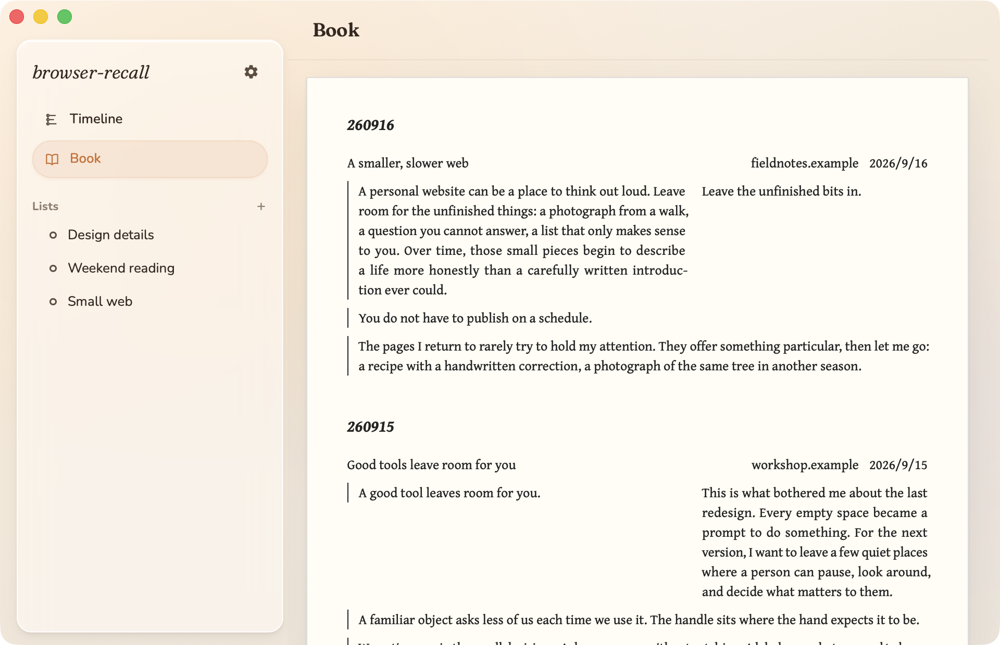

# Browser Recall

For the things you meant to come back to.

Browser Recall keeps your browsing history, highlights, and saved pages in a folder on your computer. Browse as usual. Come back when a half-remembered sentence starts bothering you.

## While you browse

The **browser extension** keeps the current page close at hand. Pin the page to a list, leave a rating, or save a **snapshot** to read later, even offline.

## Keep a line, and your thought

Save a **highlight** from something you are reading. Add a **note** while the thought is still fresh.

**Book** brings those passages and notes together, grouped by day.

## Find your way back

**Timeline** brings your visits together. Search titles and URLs, highlights, notes, or text in saved snapshots. A page does not have to make it into your bookmarks to be worth finding again.

## Keep a small collection

**Lists** give a small project, a passing interest, or a weekend reading pile a place to live. Pin pages yourself, or add a keyword rule that collects matching page titles.

## A folder of your own

History, notes, lists, and snapshots live on your computer. No Browser Recall account. No analytics or telemetry. Optional sync uses a GitHub repository you control.

The desktop app holds your collection. The browser extension records visits and lets you highlight, save, and pin without leaving the page. Keep the desktop app running while you browse.

[Read the privacy policy](docs/PRIVACY.md)

## Try Browser Recall

Browser Recall currently has a [source-build setup](DEVELOPMENT.md#building). You need the desktop app and the [browser extension](DEVELOPMENT.md#loading-the-extension).

Chrome, Edge, and Orion use the Chromium extension build. Firefox has a separate build.

---

[Development](DEVELOPMENT.md) · [Architecture](docs/ARCHITECTURE.md) · [Codebase map](docs/CODEBASE_MAP.md) · MIT licensed

Screenshots show the real macOS app and browser extension with fictional reading data. The opening image combines Amber and Mono captures programmatically. [Regenerate the screenshots](DEVELOPMENT.md#documentation-screenshots).
